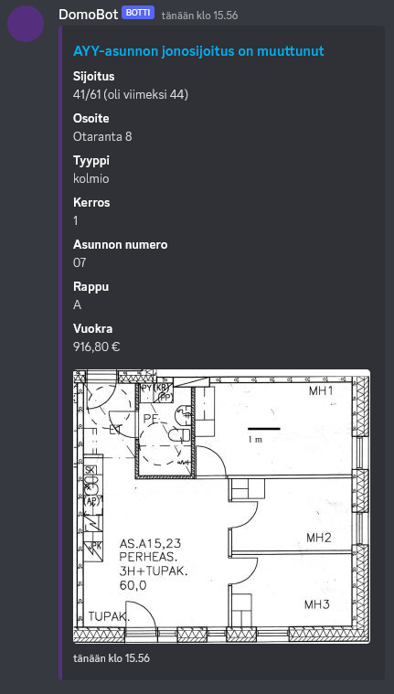
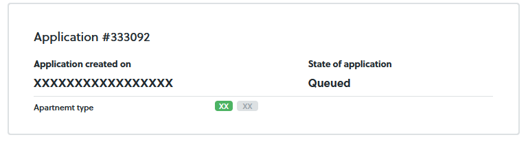

# AYY Domo Discord bot

A bot for notifying on a Discord channel when the ranking on a AYY Domo application has changed. 

Example Discord notification (currently only in Finnish):



## Running the bot

First copy the .env.dist file to a file named .env in the ./bot directory, and add the required values to the file:

- DISCORD_TOKEN: Discord token for logging into a bot account on Discord
- TIME: Time of day to check the applications' status on Domo
- DOMO_USERNAME: Username (email) for logging into Domo
- DOMO_PASSWORD: Password for logging into Domo
- APPLICATION_IDS: ID numbers of applications to be checked on Domo (visible on the Domo front page)
  
- CHANNEL_ID: ID of Discord channel to send notifications to. See the [Discord docs](https://support.discord.com/hc/en-us/articles/206346498-Where-can-I-find-my-User-Server-Message-ID-) for instructions.

### Docker

The bot is the easiest to use with Docker. After populating the .env file, start the bot with the command
```bash
docker compose up
```
The bot can be updated by running 
```bash
docker compose up --build
```
after pulling the latest sources.

### Without Docker

Requirements: node.js

After populating the .env file, open a terminal in the ./bot directory. Run the following commands:

```bash
npm ci
node ./node_modules/typescript/bin/tsc
node ./dist/bot.js
```

Not affiliated with Domo or AYY.